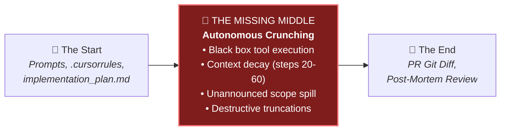
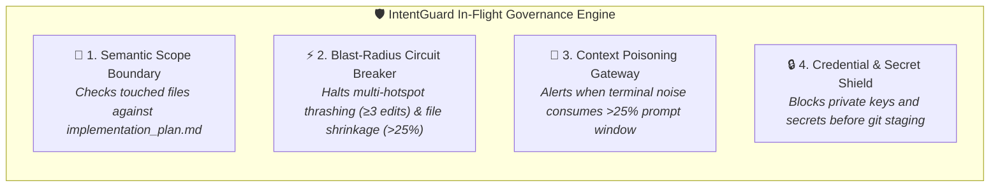

<div align="center">

# 🛡️ IntentGuard: Autonomous AI Coding Control Plane & Rollback Suite
### Inline Governance, Blast-Radius Circuit Breakers, and 1-Click Rollbacks for Autonomous Coding Agents
#### Supporting Google Antigravity, Anthropic Claude (Claude Code / Desktop / Cline), and OpenAI Codex

[](https://marketplace.visualstudio.com/)
[](#persona-b-the-terminal-purist-headless-cli)
[](#persona-c-the-devops-gatekeeper-github-action)
[](LICENSE)
[](#core-differentiator-the-missing-middle)

---

</div>

## 💡 The Problem: The "Missing Middle" in AI Coding

Autonomous coding agents (Claude Code, Antigravity, Codex) have moved from simple chat interfaces to full multi-file autonomous execution loops. However, teams and developers are completely **blind** to what happens during the crunch:



* **Tools at the Start** (system prompts, `.cursorrules`, specs) set intentions, but agents drift and hallucinate after 20+ steps.
* **Tools at the End** (PR diffs, test runners, CI logs) only catch mistakes after the agent has already wasted tokens, corrupted working trees, or truncated critical logic.
* **The Missing Middle**: There has been no inline control plane to govern agent tool calls **mid-flight**.

**IntentGuard** fills this gap as the **autonomous inline control plane**. It continuously monitors agent executions against declared intent boundaries, trips blast-radius circuit breakers when thrashing occurs, and provides instantaneous 1-click rollbacks for out-of-scope files.

---

## 🛡️ The 4 In-Flight Control Interventions



1. **Semantic Scope Boundary**: Parses declared files from `implementation_plan.md`. If an agent edits `server.py` or `.env` without declaring it, IntentGuard immediately flags the out-of-scope spill and provides a 1-click restore command.
2. **Blast-Radius Circuit Breaker**: Evaluates churning file hotspots. If an agent loops over multiple files with ≥3 touches or truncates >25% of code unexpectedly, the circuit breaker trips to prevent doom-looping.
3. **Context Poisoning Gateway**: Diagnoses prompt context compositions, detecting when terminal log dump consumes over 25% of the active context window.
4. **Credential & Secret Shield**: Scans file modifications for leaked API keys, tokens, and credentials mid-execution.

---

## 👥 Three Personas, Three Dedicated Surfaces

IntentGuard is built on a decoupled hexagonal architecture (`@intentguard/core`), exposing tailored interfaces for every type of developer:

### 1. Persona A: Visual IDE Builder (VS Code & Cursor Cockpit)
* **Live In-Flight Governance Banner**: Real-time adherence gauge, scope spill pills, and circuit breaker indicators at the top of the dashboard.
* **Time-Travel VCR Player**: Step backward/forward through agent reasoning and file touches with keyboard shortcuts (`Space`, `←`, `→`, `1x`, `2x`, `4x`).
* **1-Click Scope Spill Revert**: Revert only out-of-scope files while keeping approved changes intact.
* **Monaco Native Diffs**: Side-by-side Before ↔ After diffs for every tool execution.
* **1-Click Agent Hand-Off**: Seamlessly fork a task and transfer state between Claude, Antigravity, and Codex.

### 2. Persona B: The Terminal Purist (Headless CLI)
For developers living in Neovim, tmux, or using Claude Code CLI directly:

```bash
# List all active & historic agent sessions
ig list

# Inspect cost, tokens, and modified files
ig inspect 2b9d2347

# Run governance audit against declared plan (exits with code 0 or 1)
ig audit 2b9d2347

# Rollback out-of-scope spill files only
ig rollback 2b9d2347 --spill-only --exec

# Benchmark two agent sessions side-by-side
ig compare 2b9d2347 c5469fae
```

### 3. Persona C: The DevOps Gatekeeper (GitHub Action)
Block agent PRs before they merge into production:

```yaml
# .github/workflows/intentguard-gate.yml
name: IntentGuard PR Gatekeeper
on: [pull_request]

jobs:
  gate:
    runs-on: ubuntu-latest
    steps:
      - uses: actions/checkout@v4
        with:
          fetch-depth: 0

      - name: Run IntentGuard Gatekeeper
        uses: akmalkhaniub/intentguard/action@main
        with:
          plan_path: 'implementation_plan.md'
          fail_on_circuit_break: 'true'
          fail_on_spill: 'false'
```

Automatically generates an AI agent governance scorecard on every PR:

| Metric | Value | Status |
| :--- | :--- | :--- |
| **Intent Adherence** | `94%` | 🟢 Compliant |
| **Circuit Breaker** | `ARMED` | 🟢 Safe |
| **Planned & Executed** | `8 files` | 🟢 In-Bounds |
| **Unplanned Scope Spill** | `0 files` | 🟢 Zero Spill |

---

## 🚀 Quick Start & Installation

### Option 1: Install VS Code Extension
1. Download `intentguard-0.8.0.vsix` from releases or build locally:
   ```bash
   npm run compile
   npm run package
   code --install-extension intentguard-0.8.0.vsix --force
   ```
2. Open VS Code and run `Ctrl+Shift+P` -> **IntentGuard: Open IntentGuard Cockpit**.

### Option 2: Install Headless CLI
```bash
npm link
# or run directly:
node dist/cli.js --help
```

---

## 🔄 Backward Compatibility
IntentGuard retains 100% backward compatibility with all existing extensions and commands:
* `agentlens.openVisualizer` & `agentlens.refreshSessions`
* `antigravity.openVisualizer` & `antigravity.refreshSessions`

---

## 📜 License
MIT © [akmalkhaniub](https://github.com/akmalkhaniub)
