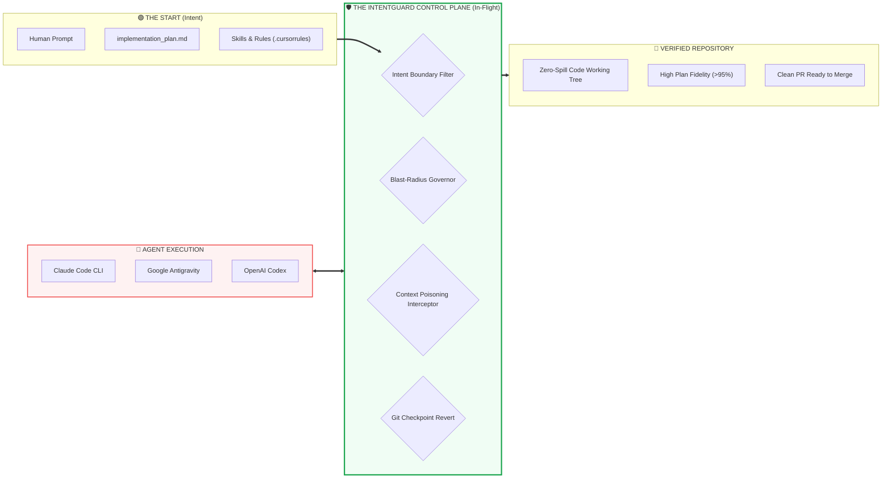
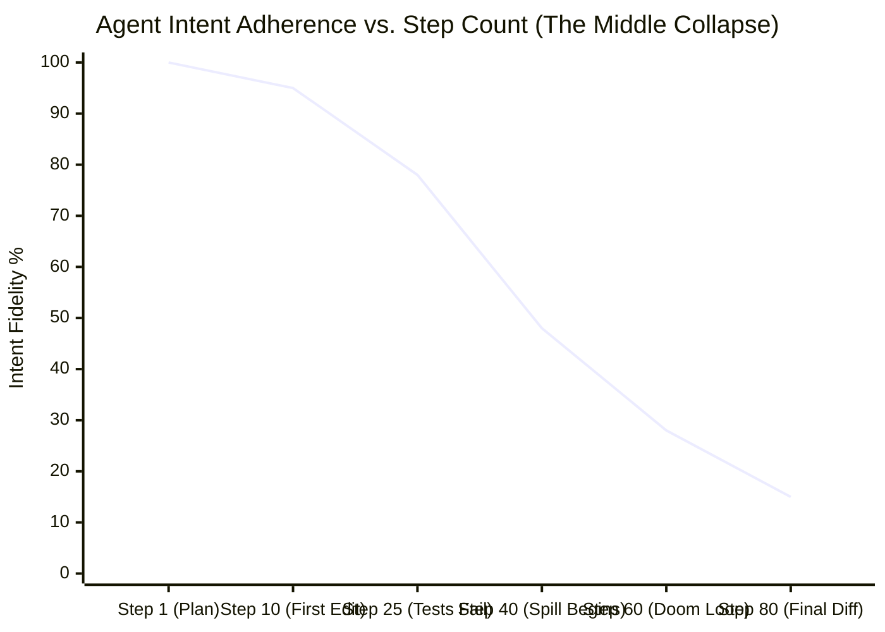
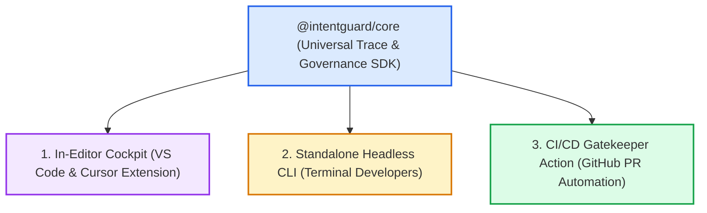
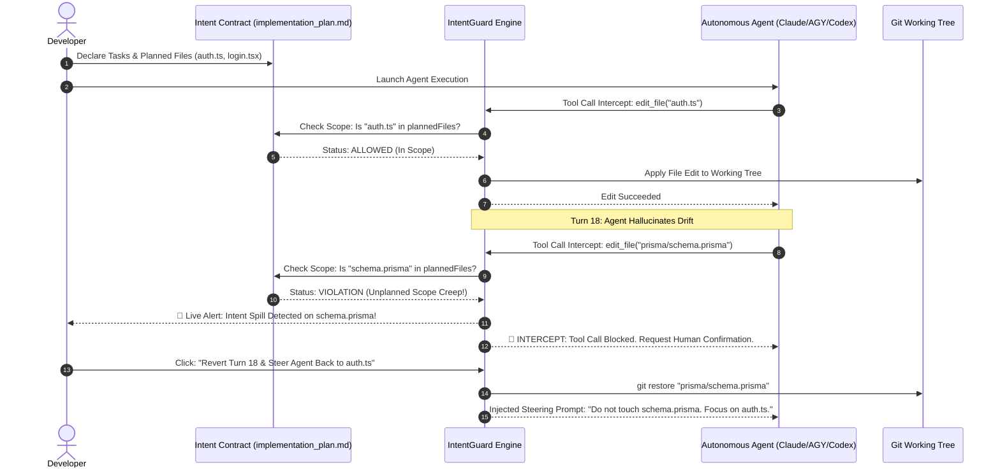
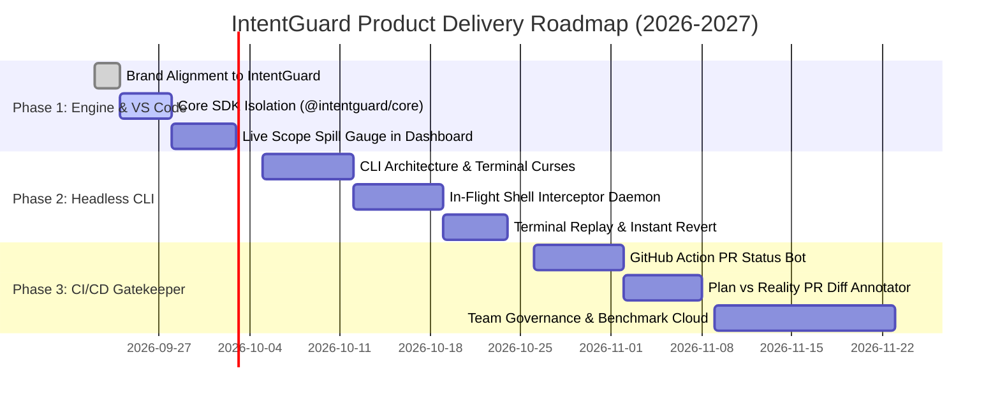

# 🛡️ IntentGuard: The Autonomous Agent Control Plane & In-Flight Intent Governor

**Universal In-Flight Intent Enforcement, Requirement Spill Interception, and Blast-Radius Governance for AI Coding Agents.**  
*Supporting Anthropic Claude, Google Antigravity, and OpenAI Codex.*

---

- **Document Version**: `1.0.0-SPEC`  
- **Date**: `September 22, 2026`  
- **Author**: `Akmal Khan & Core Engineering Team`  
- **Repository**: [`https://github.com/akmalkhaniub/agentlens`](https://github.com/akmalkhaniub/agentlens) *(Target Brand: IntentGuard)*  
- **Classification**: `Product Architecture & Spec-Driven Roadmap`

---

## Executive Summary

Modern AI software development suffers from an acute **"Missing Middle"** crisis:
1. **The Start (Well-Served)**: Developers write thorough prompts, rules (`.cursorrules`), and architectural blueprints (`implementation_plan.md`).
2. **The End (Post-Mortem)**: Developers review giant 1,500-line git diffs, broken test suites, and pull requests.
3. **The Middle (The Black Hole)**: Between prompt and output, autonomous coding agents execute 50–100 cognitive tool steps in an unmonitored black box. As step count increases, **context decay and cognitive drift** cause agents to silently refactor unrelated files, leak secrets, hollow out functions, and spill outside declared requirements.

**IntentGuard** is the **first inline Agent Control Plane** that sits directly between agent reasoning and your git repository. It dynamically derives the **Intent Boundary** from the developer's specification, monitors every file edit and command in real-time, circuit-breaks out-of-scope modifications before they damage code, and provides instant 1-click git rollbacks.



---

## 1. The Industry Problem: Why "The Middle" Collapses

When autonomous agents process complex software tasks, fidelity to initial requirements decays as step count increases:



### The 4 Manifestations of Cognitive Drift

| Failure Mode | How It Manifests in the Middle | IntentGuard In-Flight Solution |
| :--- | :--- | :--- |
| **1. Scope Creep / Requirement Spill** | Asked to update an auth token in `auth.ts`, the agent silently modifies the database schema in `schema.prisma` and updates 10 routing files. | **Semantic Scope Boundary**: Validates every file edit against the declared plan. Flags out-of-scope edits instantly. |
| **2. High Churn & Destructive Loops** | Agent fails a compiler check and repeatedly edits the same 400-line file 8 times, gradually deleting error-handling code to silence warnings. | **Blast-Radius Circuit Breaker**: Trips when a file is modified >3 times in one turn or shrinks by >25%. |
| **3. Context Poisoning** | Agent executes `npm test` and receives 3,000 lines of terminal noise, flushing out the original instructions from active attention. | **Noise Compaction Gateway**: Intercepts noisy stdout/stderr, compressing it into structured summaries for the agent while keeping raw logs for humans. |
| **4. Accidental Secret & Token Leaks** | Agent outputs an unmasked API key or bearer token into file logs or bash arguments. | **Zero-Tolerance Credential Shield**: Blocks execution immediately upon detecting token entropy patterns (`sk-`, `ghp_`, `AIzaSy`). |

---

## 2. Multi-Persona Segmentation Strategy

To build IntentGuard as a venture-scale product without regressing or bloating the existing VS Code experience, we delineate three independent consumer surfaces powered by a single core SDK:



### Persona A: The In-Editor Developer (VS Code / Cursor)
- **Interface**: Visual extension dashboard with time-travel VCR scrubbing, Monaco split diffs, and 1-click restore buttons.
- **Workflow**: Real-time side-by-side execution view that pulses red when the agent steps out of bounds.

### Persona B: The Terminal Purist (Claude Code CLI / Neovim / tmux)
- **Interface**: Standalone CLI (`intentguard` or `ig`).
- **Workflow**: Terminal curses UI running in a split pane; intercepts shell processes and generates instant rollback commands (`ig rollback --step 14`).

### Persona C: The Team Lead & DevOps Engineer (CI/CD PR Audits)
- **Interface**: GitHub Action (`intentguard/action@v1`).
- **Workflow**: Runs on every pull request generated by an agent. Audits plan fidelity, scans for secret leaks, checks token costs, and posts a rich status check before merging.

---

## 3. Spec-Driven Architecture & Contract Specification

All components communicate through a strictly versioned contract: the **Universal Trace & Intent Specification (UTIS v1.0)**.

### Sequence Diagram: In-Flight Governance Flow



---

## 4. Universal Intent & Trace Schema (`utis.schema.json`)

```json
{
  "$schema": "https://json-schema.org/draft/2020-12/schema",
  "title": "UniversalIntentTrace",
  "type": "object",
  "required": [
    "sessionId",
    "brand",
    "model",
    "declaredIntent",
    "steps",
    "governanceStatus",
    "costMetrics"
  ],
  "properties": {
    "sessionId": { "type": "string" },
    "brand": { "type": "string", "enum": ["claude", "antigravity", "codex", "custom"] },
    "model": { "type": "string" },
    "declaredIntent": {
      "type": "object",
      "properties": {
        "hasPlan": { "type": "boolean" },
        "plannedFiles": { "type": "array", "items": { "type": "string" } },
        "userGoal": { "type": "string" }
      }
    },
    "governanceStatus": {
      "type": "object",
      "properties": {
        "intentAdherenceRate": { "type": "number", "minimum": 0, "maximum": 100 },
        "scopeSpillFiles": { "type": "array", "items": { "type": "string" } },
        "churnHotspots": { "type": "array", "items": { "type": "string" } },
        "circuitBreakerTripped": { "type": "boolean" },
        "riskGrade": { "type": "string", "enum": ["LOW", "MEDIUM", "CRITICAL"] }
      }
    },
    "rollbackPlan": {
      "type": "object",
      "properties": {
        "isolatedFiles": { "type": "array", "items": { "type": "string" } },
        "gitRestoreCommand": { "type": "string" },
        "reversePatches": { "type": "array", "items": { "type": "string" } }
      }
    }
  }
}
```

---

## 5. Phased Product Roadmap



---

## 6. Zero-Breakage Isolation Strategy

To guarantee that adding the CLI and CI/CD tools **never degrades or breaks the VS Code extension**:
1. **Core SDK as a Headless NPM Package**: All business algorithms (parsing, diffing, rate cards, risk scan) reside in `@intentguard/core`.
2. **Backward-Compatible Message Protocol**: The VS Code webview message bus continues accepting legacy `setSessionData`, `openNativeDiff`, and `runInTerminal` commands without schema drift.
3. **No Dynamic Network Calls**: The VS Code extension remains 100% self-contained, local, and air-gapped with bundled vendor dependencies.
