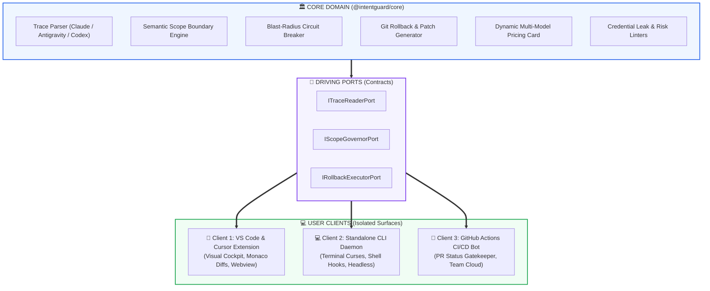
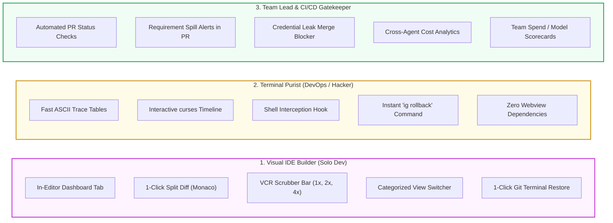

# 👥 IntentGuard: Multi-Persona Separation & Surface Architecture Plan

**Ensuring Zero Regressions for VS Code Users While Scaling to CLI and Enterprise CI/CD.**

---

- **Document Version**: `1.0.0-PLAN`  
- **Date**: `September 22, 2026`  
- **Author**: `Akmal Khan & Core Engineering Team`  
- **Repository**: [`https://github.com/akmalkhaniub/agentlens`](https://github.com/akmalkhaniub/agentlens) *(IntentGuard Monorepo)*  
- **Status**: `Approved for Execution`

---

## 1. Architectural Separation of Concerns

To allow independent evolution of each interface, we enforce a strict **Hexagonal / Ports-and-Adapters Architecture**:



---

## 2. Persona Breakdown & Dedicated Features



---

## 3. How We Guarantee Zero Regressions for the VS Code Extension

| Risk Area | Why Extensions Usually Break | IntentGuard Defensive Architecture |
| :--- | :--- | :--- |
| **1. Webview Message Protocol** | Adding CLI features alters JSON payloads, causing webview JS exceptions. | **Fixed Schema Guard**: Webview message handlers (`setSessionData`, `openNativeDiff`, `runInTerminal`) remain 100% frozen. New fields are strictly additive and optional. |
| **2. Bundle Size & Startup Time** | Adding heavy CLI dependencies (like Ink, Commander, or Chalk) bloats the extension. | **Separate Bundles**: The VS Code extension only bundles `@intentguard/core` via `esbuild`. The CLI has its own separate entry point and dependencies. |
| **3. Offline / Air-Gapped Operation** | Adding cloud analytics breaks air-gapped environments. | **Local-First Mandate**: The VS Code client operates with zero remote network calls (`default-src 'none'`). All vendor scripts (`mermaid`, `marked`) stay bundled in `media/vendor/`. |
| **4. Command Namespaces** | Changing command names breaks existing keybindings and custom shortcuts. | **Dual Registration**: The extension registers both new `intentguard.*` commands AND preserves legacy `agentlens.*` and `antigravity.*` aliases. |

---

## 4. Deliverable Matrix by Persona

| Persona | Deliverable Artifact | Distribution Channel | Installation Command |
| :--- | :--- | :--- | :--- |
| **Visual In-Editor** | `intentguard-vscode-*.vsix` | VS Code Marketplace & Open VSX | `code --install-extension intentguard.vsix` |
| **Terminal Purist** | Standalone Node / Native Binary | NPM & Homebrew | `npm install -g @intentguard/cli` or `brew install intentguard` |
| **Team / CI/CD** | GitHub Action Template | GitHub Marketplace | `uses: akmalkhaniub/intentguard-action@v1` |

---

## 5. Monorepo Directory Layout

```
g:/ReplitProjects/antigravity-vscode-extension/
├── docs/
│   ├── INTENTGUARD_SPEC.md            <-- Master Product Architecture
│   └── PERSONA_SEPARATION_PLAN.md      <-- This Multi-Persona Plan
├── packages/
│   ├── core/                          <-- Shared Headless SDK (@intentguard/core)
│   │   ├── src/
│   │   │   ├── adapters/              <-- Claude, AGY, Codex Normalizers
│   │   │   ├── governor/              <-- Scope & Churn Circuit Breaker
│   │   │   ├── economics/             <-- Multi-Model Dynamic Rate Cards
│   │   │   └── index.ts
│   │   └── package.json
│   │
│   ├── vscode/                        <-- Current VS Code Extension (Hardened)
│   │   ├── src/
│   │   ├── media/                     <-- Local mermaid, marked, UI
│   │   └── package.json
│   │
│   ├── cli/                           <-- Standalone Terminal Tool (Phase 2)
│   │   ├── src/index.ts               <-- 'ig list', 'ig inspect', 'ig rollback'
│   │   └── package.json
│   │
│   └── action/                        <-- GitHub PR Action Gatekeeper (Phase 3)
│       ├── action.yml
│       └── src/index.ts
└── package.json                       <-- Root Workspace Manager
```
